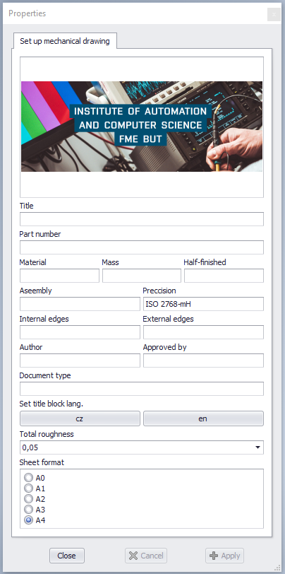

### IACS-Inventor template
**This is [IACS](https://uai.fme.vutbr.cz/en/) non-official inventor template!** 

### Introduction

Main purpose of this repository is allow good base for customization inventor template. Template is created and modifed from originaly [IMID](http://www.ustavkonstruovani.cz/en/) template, but contain only basics features, more specifics features must be programmed by your taste and needs.

### Integration part
Follow the steps to integrate into Inventor(save-go):
1) download - ```git clone https://github.com/Steigner/IACS-Inventor_template.git```
2) open *Template_IACS* //can be used .iwd, .dwg
3) save as template to e.g. *../Inventor/Templates/en-US/..*
4) restart Inventor
5) designe component -> new -> and u are ready to create tech. documenatation

### Functions
#### v1.0
* <p align="justify"> iTrigger - In iTrigger can be set Title, Part number, Material, Mass, Half-finished, Assembly, Preccision, Internal edges, External edges, Author, Approved by, Document type, Set title block. lang.[cz/en], Total roughness[0.012-6.3], Sheet format[A0-A4].
* Sketch symbols - Total roughness[set in iTrigger], Unmachined, Edges[set in iTrigger] </p>
* Title blocks - ÚAI, IACS
* After save drawing, scale will be add

<p align="center">
  
</p>

### Modification part
If u want just modifed logo in title block documentation, follow:
1) Model -> Drawing Resources -> Title blocks
2) right click on e.g. IACS, and Edit
3) now u will be able to modifed logo and other stuff

In this original template is 2 title block language options[czech/english], but more can be added:
1) Model -> Drawing Resources -> Title blocks
2) right click on e.g. IACS, and Copy
   * or right click on e.g. IACS, and Insert
4) right click on Title blocks, and Paste
5) change name e.g. "de" -> right click Edit -> right click on e.g. Preccision, Edit text -> rename only text without ```<>``` e.g. Preccision - Präzision
6) save title block
7) find iLogic -> Rules -> add Rule, name it for example "de" -> add to code editor

```javascript
        ActiveSheet.TitleBlock = de
```

8) save&run
9) Forms -> right click on Edit -> find new rule, and drag&drop into form -> OK

On that note can be added additional features by personal needs e.g. bill of materials, auto-caulcation mass and various calculations. If you find any bug or any inexactitude please leave issue comment. If you like it, hit star button and forked into your new project. 

### References
* [original template IMID](https://www.facebook.com/UstavKonstruovani/videos/pro-nový-akademický-rok-jsme-pro-vás-připravili-aktualizovanou-verzi-šablony-pro/381084085905940/)
* [Faculty of Mechanical Engineering BUT](https://www.fme.vutbr.cz/en)
